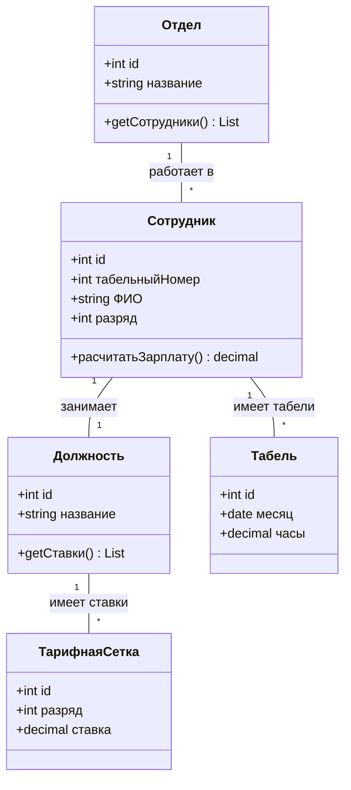
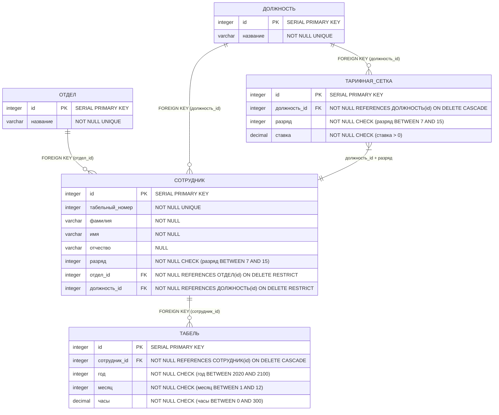

Лабораторные работы по Базам Данных  
Костюк Иван 02261-ДБ  
Вариант 20. Зарплата
Постановка задачи: Расчет заработной платы предприятия
1. Описание предметной области:
Система предназначена для автоматизации расчета ежемесячной заработной платы сотрудников предприятия, организованных в отделы. Расчет основывается на тарифной сетке (ставка за час) и данных об отработанном времени.

2. Перечень сущностей и их атрибутов (на основе ER-диаграммы):

ОТДЕЛЫ (departments)

id (PK) — Уникальный идентификатор отдела.

название (VARCHAR) — Наименование отдела.

СОТРУДНИКИ (employees)

id (PK) — Уникальный идентификатор сотрудника (внутренний).

табельный_номер (INT) — Уникальный табельный номер сотрудника.

фамилия (VARCHAR) — Фамилия сотрудника.

имя (VARCHAR) — Имя сотрудника.

отчество (VARCHAR) — Отчество сотрудника.

должность (VARCHAR) — Должность сотрудника (логически связана с ТАРИФНАЯ_СЕТКА.должность).

разряд (INT) — Разряд сотрудника (логически связан с ТАРИФНАЯ_СЕТКА.разряд).

id_отдела (FK -> ОТДЕЛЫ.id) — Идентификатор отдела, в котором работает сотрудник.

ТАРИФНАЯ_СЕТКА (pay_scales)

id (PK) — Уникальный идентификатор записи в тарифной сетке.

должность (VARCHAR) — Наименование должности.

разряд (INT) — Разряд (от 7 до 15).

ставка_руб_час (DECIMAL) — Часовая тарифная ставка для данной должности и разряда.

ТАБЕЛЬ (timesheets)

id (PK) — Уникальный идентификатор записи в табеле.

id_сотрудника (FK -> СОТРУДНИКИ.id) — Идентификатор сотрудника.

год (INT) — Год отчетного периода.

месяц (INT) — Месяц отчетного периода.

отработано_часов (DECIMAL) — Количество часов, отработанных сотрудником в указанном месяце.

3. Связи между сущностями (Relationships):

РАБОТАЕТ (рабочее место): Связь между СОТРУДНИКИ и ОТДЕЛЫ. Один сотрудник работает только в одном отделе (id_отдела). В одном отделе может работать много сотрудников. (1:N).

ИМЕЕТ_ТАРИФ: Связь между СОТРУДНИКИ и ТАРИФНАЯ_СЕТКА. Ставка сотрудника определяется парой атрибутов (должность, разряд), которые должны существовать в тарифной сетке. Это логическая связь по атрибутам.

ИМЕЕТ_ЗАПИСИ (табель учета): Связь между СОТРУДНИКИ и ТАБЕЛЬ. На одного сотрудника ежемесячно заводится одна запись в табеле (за конкретный год и месяц). Для одного сотрудника набирается много записей за разные периоды. (1:N).

4. Основные бизнес-процессы:

Управление справочниками: Ведение списка отделов и тарифной сетки.

Управление кадрами: Ведение списка сотрудников, их привязка к отделам и назначение должности/разряда.

Учет рабочего времени: Ежемесячное заполнение табеля учета рабочего времени для каждого сотрудника.

Расчет заработной платы: Автоматический расчет суммы к выплате для каждого сотрудника за период по формуле:
Зарплата = (Ставка_сотрудника) * (Отработано_часов)
где Ставка_сотрудника определяется поиском в ТАРИФНАЯ_СЕТКА по его должности и разряду.

5. Требуемые выходные документы (отчеты):

Расчетная ведомость за период: Список для выдачи зарплаты сотрудникам за указанный месяц и год. Должен содержать: отдел, табельный номер, ФИО, должность, разряд, часовую ставку, количество отработанных часов, сумму к выплате. Упорядочить по отделам, а внутри отдела — по ФИО сотрудника.

Сводка по квалификации отделов: Аналитический отчет, показывающий распределение сотрудников по разрядам в разрезе отделов. Должен содержать: название отдела, разряд, количество сотрудников данного разряда в отделе. Упорядочить по названию отдела.
## ER-диаграмма


## Логическая модель по диаграмме


##Физическая модель 

##2 Лабораторная
Создаем 5 таблиц


далее записываем данные и выводим их для проверки для всех 5 таблиц


здесь Выполнены SELECT-запросы c JOIN


##3 Лабораторная

создадим 2 представления 
расчетная ведомость


сводка по разрядам


процедура для подсчета зарплаты

процедура для добавления табеля
## 4 лаба
генератор отделов
```code
CREATE OR REPLACE PROCEDURE kostuk.генерировать_отделы(количество_отделов INTEGER)
LANGUAGE plpgsql
AS $$
DECLARE
    названия TEXT[] := ARRAY[
        'Лесозаготовительный', 'Распиловочный', 'Сортировочный', 
        'Сушка древесины', 'Склад готовой продукции', 'Транспортный',
        'Ремонтно-механический', 'Энергетический', 'Лаборатория качества',
        'Охрана труда', 'Бухгалтерия', 'Отдел кадров', 'Снабжение',
        'Сбыт', 'Экологический', 'Склад сырья', 'Упаковочный',
        'Контроль качества', 'Производственный', 'Администрация'
    ];
BEGIN
    INSERT INTO kostuk."Отдел" (название)
    SELECT 
        названия[1 + ((seq-1) % array_length(названия, 1))]  
        ' №'  seq::TEXT
    FROM generate_series(1, количество_отделов) as seq;
END;
$$;
```

генератор должностей
```code
CREATE OR REPLACE PROCEDURE kostuk.генерировать_должности(количество_должностей INTEGER)
LANGUAGE plpgsql
AS $$
BEGIN
    INSERT INTO kostuk."Должность" (название)
    SELECT 'Должность ' || seq::TEXT
    FROM generate_series(1, количество_должностей) as seq;
END;
$$;
```

тарифы
```code
CREATE OR REPLACE PROCEDURE kostuk.генерировать_тарифы(количество_тарифов INTEGER)
LANGUAGE plpgsql
AS $$
DECLARE
    должности_count INTEGER;
    i INTEGER := 0;
    position_id INTEGER;
    grade INTEGER;
    min_grade INTEGER := 7;
    max_grade INTEGER := 15;
    grade_range INTEGER := max_grade - min_grade + 1; -- 9 разрядов (7-15 включительно)
BEGIN
    SELECT COUNT(*) INTO должности_count FROM kostuk."Должность";
    
    -- Максимально возможное количество уникальных тарифов
    DECLARE
        max_possible_tariffs INTEGER;
    BEGIN
        max_possible_tariffs := должности_count * grade_range;
        
        -- Если запрашиваем больше, чем возможно, ограничиваем
        IF количество_тарифов > max_possible_tariffs THEN
            RAISE NOTICE 'Максимально возможное количество тарифов: %', max_possible_tariffs;
            количество_тарифов := max_possible_tariffs;
        END IF;
    END;
    
    -- Генерируем тарифы пока не достигнем нужного количества
    WHILE i < количество_тарифов LOOP
        -- Случайная должность
        SELECT id INTO position_id 
        FROM kostuk."Должность" 
        ORDER BY RANDOM() 
        LIMIT 1;
        
        -- Случайный разряд от 7 до 15
        grade := min_grade + (RANDOM() * (grade_range - 1))::INTEGER;
        
        -- Пытаемся вставить
        INSERT INTO kostuk."Тарифная_Сетка" (должность_id, разряд, ставка)
        VALUES (position_id, grade, 100 + (RANDOM() * 1900)::NUMERIC(10,2))
        ON CONFLICT (должность_id, разряд) DO NOTHING;
        
        -- Если вставка прошла успешно (не было конфликта), увеличиваем счетчик
        IF FOUND THEN
            i := i + 1;
        END IF;
    END LOOP;
    
    RAISE NOTICE 'Создано тарифов: %', i;
END;
$$;
```

генератор сотрудников
```code
CREATE OR REPLACE PROCEDURE kostuk.генерировать_сотрудников(количество_сотрудников INTEGER)
LANGUAGE plpgsql
AS $$
DECLARE
    фамилии TEXT[] := ARRAY[
        'Иванов','Петров','Сидоров','Козлов','Смирнов','Михайлов','Новиков',
        'Кузнецов','Попов','Васильев','Фёдоров','Морозов','Волков','Зайцев',
        'Лебедев','Соколов','Орлов','Егоров','Никитин','Соловьёв',
        'Белов','Григорьев','Тихонов','Алексеев','Филиппов','Андреев',
        'Макаров','Николаев','Степанов','Захаров','Павлов','Романов',
        'Владимиров','Сергеев','Герасимов','Борисов','Кириллов','Денисов',
        'Тимофеев','Матвеев','Артемьев','Яковлев','Данилов','Георгиев'
    ];
    имена_мужские TEXT[] := ARRAY[
        'Иван','Алексей','Дмитрий','Сергей','Андрей','Николай','Павел',
        'Виктор','Максим','Артём','Владимир','Михаил','Георгий','Олег',
        'Юрий','Анатолий','Василий','Пётр','Константин','Егор',
        'Александр','Евгений','Вячеслав','Григорий','Леонид','Роман',
        'Тимур','Станислав','Валерий','Борис','Даниил','Тимофей',
        'Фёдор','Семён','Макар','Захар','Кирилл','Денис','Матвей','Ярослав'
    ];
    отчества_мужские TEXT[] := ARRAY[
        'Иванович','Петрович','Сергеевич','Алексеевич','Дмитриевич','Андреевич',
        'Викторович','Михайлович','Владимирович','Олегович','Юрьевич','Геннадьевич',
        'Николаевич','Павлович','Анатольевич','Васильевич','Константинович',
        'Егорович','Александрович','Евгеньевич','Вячеславович','Григорьевич',
        'Леонидович','Романович','Тимурович','Станиславович','Валериевич',
        'Борисович','Даниилович','Тимофеевич','Фёдорович','Семёнович',
        'Макарович','Захарович','Кириллович','Денисович','Матвеевич','Ярославович'
    ];
    max_табельный INTEGER;
BEGIN
    SELECT COALESCE(MAX(табельный_номер), 100000)
    INTO max_табельный
    FROM kostuk."Сотрудник";

    INSERT INTO kostuk."Сотрудник" (табельный_номер, ФИО, разряд, отдел_id, должность_id)
    SELECT
        max_табельный + seq,
        фамилии[1 + ((seq-1) % array_length(фамилии, 1))]  ' ' 
        имена_мужские[1 + ((seq-1) % array_length(имена_мужские, 1))]  ' ' 
        отчества_мужские[1 + ((seq-1) % array_length(отчества_мужские, 1))],
        (SELECT разряд FROM kostuk."Тарифная_Сетка" ORDER BY RANDOM() LIMIT 1),
        (SELECT id FROM kostuk."Отдел" ORDER BY RANDOM() LIMIT 1),
        (SELECT id FROM kostuk."Должность" ORDER BY RANDOM() LIMIT 1)
    FROM generate_series(1, количество_сотрудников) as seq;
END;
$$;
```

генератор табеля
```code
CREATE OR REPLACE PROCEDURE kostuk.генерировать_табель_уникальный(количество_записей INTEGER)
LANGUAGE plpgsql
AS $$
DECLARE
    i INTEGER := 0;
BEGIN
    WHILE i < количество_записей LOOP
        INSERT INTO kostuk."Табель" (сотрудник_id, год, месяц, часы)
        SELECT
            (SELECT id FROM kostuk."Сотрудник" ORDER BY RANDOM() LIMIT 1),
            2023 + (RANDOM() * 3)::INTEGER,
            1 + (RANDOM() * 11)::INTEGER,
            80 + (RANDOM() * 120)::NUMERIC(6,2)
        ON CONFLICT (сотрудник_id, год, месяц) DO NOTHING;
        
        -- Считаем сколько реально добавилось
        i := i + 1;
    END LOOP;
END;
$$;
```

анализ запросов
```code
EXPLAIN ANALYZE
SELECT * FROM kostuk."Отдел" WHERE id = 100;

EXPLAIN ANALYZE
SELECT * FROM kostuk."Отдел" WHERE название LIKE 'Лесозаготовительный';

EXPLAIN ANALYZE
SELECT * FROM kostuk."Должность" WHERE id = 500;

EXPLAIN ANALYZE
SELECT * FROM kostuk."Должность" WHERE название LIKE 'инженер';

EXPLAIN ANALYZE
SELECT * FROM kostuk."Тарифная_Сетка" WHERE разряд BETWEEN 10 AND 12;

EXPLAIN ANALYZE
SELECT 
    ts.*,
    d.название as должность
FROM kostuk."Тарифная_Сетка" ts
JOIN kostuk."Должность" d ON ts.должность_id = d.id
WHERE ts.ставка > 1000;

EXPLAIN ANALYZE
SELECT * FROM kostuk."Сотрудник" WHERE разряд >= 10;

EXPLAIN ANALYZE
SELECT 
    s.*,
    d.название as должность,
    o.название as отдел
FROM kostuk."Сотрудник" s
JOIN kostuk."Должность" d ON s.должность_id = d.id
JOIN kostuk."Отдел" o ON s.отдел_id = o.id
WHERE s.ФИО LIKE 'Иванов';

EXPLAIN ANALYZE
SELECT * FROM kostuk."Табель" WHERE год = 2024 AND месяц = 6;

EXPLAIN ANALYZE
SELECT 
    t.*,
    s.ФИО,
    s.разряд
FROM kostuk."Табель" t
JOIN kostuk."Сотрудник" s ON t.сотрудник_id = s.id
WHERE t.часы > 150;
```

создали индекс

принудительно отключили его

без индекса

с индексом 

с индексами производительность быстрее
## 5 Лаба
-- 1. ТРИГГЕР КАСКАДНОГО УДАЛЕНИЯ ТАБЕЛЯ ПРИ УДАЛЕНИИ СОТРУДНИКА
```code
CREATE OR REPLACE FUNCTION kostuk.delete_tabel_cascade_function()
RETURNS TRIGGER
LANGUAGE plpgsql
AS $$
BEGIN
    RAISE NOTICE 'Триггер запущен! Удаляем табель сотрудника ID %', OLD.id;
    DELETE FROM kostuk."Табель" WHERE сотрудник_id = OLD.id;
    RETURN OLD;
END;
$$;
```
```code
CREATE OR REPLACE TRIGGER delete_tabel_cascade_trigger
    BEFORE DELETE ON kostuk."Сотрудник"
    FOR EACH ROW
    EXECUTE FUNCTION kostuk.delete_tabel_cascade_function();
```
-- 2. ТРИГГЕР КАСКАДНОГО УДАЛЕНИЯ СОТРУДНИКОВ ПРИ УДАЛЕНИИ ОТДЕЛА
```code
CREATE OR REPLACE FUNCTION kostuk.delete_sotrudniki_cascade_function()
RETURNS TRIGGER
LANGUAGE plpgsql
AS $$
BEGIN
    RAISE NOTICE 'Триггер запущен! Удаляем сотрудников отдела ID %', OLD.id;
    DELETE FROM kostuk."Сотрудник" WHERE отдел_id = OLD.id;
    RETURN OLD;
END;
$$;
```code
CREATE OR REPLACE TRIGGER delete_sotrudniki_cascade_trigger
    BEFORE DELETE ON kostuk."Отдел"
    FOR EACH ROW
    EXECUTE FUNCTION kostuk.delete_sotrudniki_cascade_function();
```
-- 3. ТРИГГЕР КАСКАДНОГО УДАЛЕНИЯ ТАРИФОВ И СОТРУДНИКОВ ПРИ УДАЛЕНИИ ДОЛЖНОСТИ
```code
CREATE OR REPLACE FUNCTION kostuk.delete_dolzhnost_cascade_function()
RETURNS TRIGGER
LANGUAGE plpgsql
AS $$
BEGIN
    RAISE NOTICE 'Триггер запущен! Удаляем тарифы и сотрудников должности ID %', OLD.id;
    
    -- Удаляем тарифные ставки для этой должности
    DELETE FROM kostuk."Тарифная_Сетка" WHERE должность_id = OLD.id;
    
    -- Удаляем сотрудников с этой должностью
    DELETE FROM kostuk."Сотрудник" WHERE должность_id = OLD.id;
    
    RETURN OLD;
END;
$$;
```
```code
CREATE OR REPLACE TRIGGER delete_dolzhnost_cascade_trigger
    BEFORE DELETE ON kostuk."Должность"
    FOR EACH ROW
    EXECUTE FUNCTION kostuk.delete_dolzhnost_cascade_function();
```
-- 4. ТАБЛИЦА АУДИТА ДЛЯ ВСЕХ ТАБЛИЦ
```code

CREATE TABLE IF NOT EXISTS kostuk."Аудит_Общий"(
    аудит_id SERIAL PRIMARY KEY,
    операция CHAR(1) NOT NULL,  -- I=INSERT, U=UPDATE, D=DELETE
    изменено_в TIMESTAMP DEFAULT CURRENT_TIMESTAMP,
    изменено_пользователем TEXT DEFAULT CURRENT_USER,
    таблица_имя TEXT NOT NULL,
    
    -- Общие поля для всех таблиц
    запись_id INTEGER,
    
    -- Поля для таблицы Отдел
    отдел_название TEXT,
    
    -- Поля для таблицы Должность
    должность_название TEXT,
    
    -- Поля для таблицы Тарифная_Сетка
    тариф_должность_id INTEGER,
    тариф_разряд INTEGER,
    тариф_ставка NUMERIC(10,2),
    
    -- Поля для таблицы Сотрудник
    сотрудник_табельный_номер INTEGER,
    сотрудник_фио TEXT,
    сотрудник_разряд INTEGER,
    сотрудник_отдел_id INTEGER,
    сотрудник_должность_id INTEGER,
    
    -- Поля для таблицы Табель
    табель_сотрудник_id INTEGER,
    табель_год INTEGER,
    табель_месяц INTEGER,
    табель_часы NUMERIC(6,2)
);
```
-- 5. ФУНКЦИИ И ТРИГГЕРЫ АУДИТА ДЛЯ КАЖДОЙ ТАБЛИЦЫ

-- 5.1. Аудит для таблицы "Отдел"
```code
CREATE OR REPLACE FUNCTION kostuk.audit_otdel_function()
RETURNS TRIGGER
LANGUAGE plpgsql
AS $$
BEGIN
    IF (TG_OP = 'UPDATE') THEN
        INSERT INTO kostuk."Аудит_Общий"(
            операция, таблица_имя, запись_id, 
            отдел_название
        )
        VALUES (
            'U', 'Отдел', NEW.id,
            NEW.название
        );
        RETURN NEW;
    ELSEIF (TG_OP = 'DELETE') THEN
        INSERT INTO kostuk."Аудит_Общий"(
            операция, таблица_имя, запись_id, 
            отдел_название
        )
        VALUES (
            'D', 'Отдел', OLD.id,
            OLD.название
        );
        RETURN OLD;
    ELSEIF (TG_OP = 'INSERT') THEN
        INSERT INTO kostuk."Аудит_Общий"(
            операция, таблица_имя, запись_id, 
            отдел_название
        )
        VALUES (
            'I', 'Отдел', NEW.id,
            NEW.название
        );
        RETURN NEW;
    END IF;
    RETURN NULL;
END;
$$;
```
```code
CREATE OR REPLACE TRIGGER audit_otdel_trigger
    AFTER INSERT OR UPDATE OR DELETE ON kostuk."Отдел"
    FOR EACH ROW
    EXECUTE FUNCTION kostuk.audit_otdel_function();
```
-- 5.2. Аудит для таблицы "Должность"
```code
CREATE OR REPLACE FUNCTION kostuk.audit_dolzhnost_function()
RETURNS TRIGGER
LANGUAGE plpgsql
AS $$
BEGIN
    IF (TG_OP = 'UPDATE') THEN
        INSERT INTO kostuk."Аудит_Общий"(
            операция, таблица_имя, запись_id, 
            должность_название
        )
        VALUES (
            'U', 'Должность', NEW.id,
            NEW.название
        );
        RETURN NEW;
    ELSEIF (TG_OP = 'DELETE') THEN
        INSERT INTO kostuk."Аудит_Общий"(
            операция, таблица_имя, запись_id, 
            должность_название
        )
        VALUES (
            'D', 'Должность', OLD.id,
            OLD.название
        );
        RETURN OLD;
    ELSEIF (TG_OP = 'INSERT') THEN
        INSERT INTO kostuk."Аудит_Общий"(
            операция, таблица_имя, запись_id, 
            должность_название
        )
        VALUES (
            'I', 'Должность', NEW.id,
            NEW.название
        );
        RETURN NEW;
    END IF;
    RETURN NULL;
END;
$$;
```
```code
CREATE OR REPLACE TRIGGER audit_dolzhnost_trigger
    AFTER INSERT OR UPDATE OR DELETE ON kostuk."Должность"
    FOR EACH ROW
    EXECUTE FUNCTION kostuk.audit_dolzhnost_function();
```
-- 5.3. Аудит для таблицы "Тарифная_Сетка"
```code
CREATE OR REPLACE FUNCTION kostuk.audit_tarif_function()
RETURNS TRIGGER
LANGUAGE plpgsql
AS $$
BEGIN
    IF (TG_OP = 'UPDATE') THEN
        INSERT INTO kostuk."Аудит_Общий"(
            операция, таблица_имя, запись_id, 
            тариф_должность_id, тариф_разряд, тариф_ставка
        )
        VALUES (
            'U', 'Тарифная_Сетка', NEW.id,
            NEW.должность_id, NEW.разряд, NEW.ставка
        );
        RETURN NEW;
    ELSEIF (TG_OP = 'DELETE') THEN
        INSERT INTO kostuk."Аудит_Общий"(
            операция, таблица_имя, запись_id, 
            тариф_должность_id, тариф_разряд, тариф_ставка
        )
        VALUES (
            'D', 'Тарифная_Сетка', OLD.id,
            OLD.должность_id, OLD.разряд, OLD.ставка
        );
        RETURN OLD;
    ELSEIF (TG_OP = 'INSERT') THEN
        INSERT INTO kostuk."Аудит_Общий"(
            операция, таблица_имя, запись_id, 
            тариф_должность_id, тариф_разряд, тариф_ставка
        )
        VALUES (
            'I', 'Тарифная_Сетка', NEW.id,
            NEW.должность_id, NEW.разряд, NEW.ставка
        );
        RETURN NEW;
    END IF;
    RETURN NULL;
END;
$$;
```
```code
CREATE OR REPLACE TRIGGER audit_tarif_trigger
    AFTER INSERT OR UPDATE OR DELETE ON kostuk."Тарифная_Сетка"
    FOR EACH ROW
    EXECUTE FUNCTION kostuk.audit_tarif_function();
```

-- 5.4. Аудит для таблицы "Сотрудник"
```code
CREATE OR REPLACE FUNCTION kostuk.audit_sotrudnik_function()
RETURNS TRIGGER
LANGUAGE plpgsql
AS $$
BEGIN
    IF (TG_OP = 'UPDATE') THEN
        INSERT INTO kostuk."Аудит_Общий"(
            операция, таблица_имя, запись_id, 
            сотрудник_табельный_номер, сотрудник_фио, 
            сотрудник_разряд, сотрудник_отдел_id, 
            сотрудник_должность_id
        )
        VALUES (
            'U', 'Сотрудник', NEW.id,
            NEW.табельный_номер, NEW.ФИО, 
            NEW.разряд, NEW.отдел_id, 
            NEW.должность_id
        );
        RETURN NEW;
    ELSEIF (TG_OP = 'DELETE') THEN
        INSERT INTO kostuk."Аудит_Общий"(
            операция, таблица_имя, запись_id, 
            сотрудник_табельный_номер, сотрудник_фио, 
            сотрудник_разряд, сотрудник_отдел_id, 
            сотрудник_должность_id
        )
        VALUES (
            'D', 'Сотрудник', OLD.id,
            OLD.табельный_номер, OLD.ФИО, 
            OLD.разряд, OLD.отдел_id, 
            OLD.должность_id
        );
        RETURN OLD;
    ELSEIF (TG_OP = 'INSERT') THEN
        INSERT INTO kostuk."Аудит_Общий"(
            операция, таблица_имя, запись_id, 
            сотрудник_табельный_номер, сотрудник_фио, 
            сотрудник_разряд, сотрудник_отдел_id, 
            сотрудник_должность_id
        )
        VALUES (
            'I', 'Сотрудник', NEW.id,
            NEW.табельный_номер, NEW.ФИО, 
            NEW.разряд, NEW.отдел_id, 
            NEW.должность_id
        );
        RETURN NEW;
    END IF;
    RETURN NULL;
END;
$$;
```
```code
CREATE OR REPLACE TRIGGER audit_sotrudnik_trigger
    AFTER INSERT OR UPDATE OR DELETE ON kostuk."Сотрудник"
    FOR EACH ROW
    EXECUTE FUNCTION kostuk.audit_sotrudnik_function();
```
-- 5.5. Аудит для таблицы "Табель"
```code
CREATE OR REPLACE FUNCTION kostuk.audit_tabel_function()
RETURNS TRIGGER
LANGUAGE plpgsql
AS $$
BEGIN
    IF (TG_OP = 'UPDATE') THEN
        INSERT INTO kostuk."Аудит_Общий"(
            операция, таблица_имя, запись_id, 
            табель_сотрудник_id, табель_год, 
            табель_месяц, табель_часы
        )
        VALUES (
            'U', 'Табель', NEW.id,
            NEW.сотрудник_id, NEW.год, 
            NEW.месяц, NEW.часы
        );
        RETURN NEW;
    ELSEIF (TG_OP = 'DELETE') THEN
        INSERT INTO kostuk."Аудит_Общий"(
            операция, таблица_имя, запись_id, 
            табель_сотрудник_id, табель_год, 
            табель_месяц, табель_часы
        )
        VALUES (
            'D', 'Табель', OLD.id,
            OLD.сотрудник_id, OLD.год, 
            OLD.месяц, OLD.часы
        );
        RETURN OLD;
    ELSEIF (TG_OP = 'INSERT') THEN
        INSERT INTO kostuk."Аудит_Общий"(
            операция, таблица_имя, запись_id, 
            табель_сотрудник_id, табель_год, 
            табель_месяц, табель_часы
        )
        VALUES (
            'I', 'Табель', NEW.id,
            NEW.сотрудник_id, NEW.год, 
            NEW.месяц, NEW.часы
        );
        RETURN NEW;
    END IF;
    RETURN NULL;
END;
$$;
```
```code
CREATE OR REPLACE TRIGGER audit_tabel_trigger
    AFTER INSERT OR UPDATE OR DELETE ON kostuk."Табель"
    FOR EACH ROW
    EXECUTE FUNCTION kostuk.audit_tabel_function();
```
-- 6. ПРОВЕРКА ТРИГГЕРОВ

-- 6.1. Проверка каскадного удаления
```code
DO $$
DECLARE
    v_count INTEGER;
BEGIN
    RAISE NOTICE '=== ПРОВЕРКА КАСКАДНОГО УДАЛЕНИЯ ===';
    
    -- Проверяем количество записей до удаления
    SELECT COUNT(*) INTO v_count FROM kostuk."Табель";
    RAISE NOTICE 'Табель до удаления: % записей', v_count;
    
    -- Удаляем одного сотрудника
    DELETE FROM kostuk."Сотрудник" WHERE id IN (SELECT id FROM kostuk."Сотрудник" LIMIT 1);
    
    -- Проверяем количество записей после удаления
    SELECT COUNT(*) INTO v_count FROM kostuk."Табель";
    RAISE NOTICE 'Табель после удаления: % записей', v_count;
    
    RAISE NOTICE '=== ПРОВЕРКА АУДИТА ===';
    
    -- Проверяем аудит
    SELECT COUNT(*) INTO v_count FROM kostuk."Аудит_Общий";
    RAISE NOTICE 'Записей в аудите: %', v_count;
    
    -- Покажем последние 5 записей аудита
    RAISE NOTICE 'Последние записи аудита:';
END;
$$;
```
-- 6.2. Показать последние записи аудита
```code
SELECT 
    аудит_id,
    операция,
    таблица_имя,
    запись_id,
    изменено_в,
    изменено_пользователем
FROM kostuk."Аудит_Общий" 
ORDER BY изменено_в DESC 
LIMIT 10;
```
-- 6.3. Проверка аудита INSERT/UPDATE/DELETE
```code
DO $$
DECLARE
    v_отдел_id INTEGER;
    v_сотрудник_id INTEGER;
BEGIN
    -- Тест INSERT
    INSERT INTO kostuk."Отдел" (название) 
    VALUES ('Тестовый отдел для аудита') 
    RETURNING id INTO v_отдел_id;
    
    RAISE NOTICE 'Создан отдел ID: %', v_отдел_id;
    
    -- Тест UPDATE
    UPDATE kostuk."Отдел" 
    SET название = 'Тестовый отдел (изменено)' 
    WHERE id = v_отдел_id;
    
    RAISE NOTICE 'Отдел обновлен';
    
    -- Тест DELETE (с каскадом)
    DELETE FROM kostuk."Отдел" WHERE id = v_отдел_id;
    
    RAISE NOTICE 'Отдел удален (с каскадом)';
END;
$$;
```
-- 6.4. Показать подробности аудита по отделам
```code
SELECT 
    аудит_id,
    операция,
    CASE операция 
        WHEN 'I' THEN 'INSERT'
        WHEN 'U' THEN 'UPDATE' 
        WHEN 'D' THEN 'DELETE'
    END as операция_текст,
    отдел_название,
    изменено_в,
    изменено_пользователем
FROM kostuk."Аудит_Общий" 
WHERE таблица_имя = 'Отдел'
ORDER BY изменено_в DESC 
LIMIT 5;
```
-- 7. ДОПОЛНИТЕЛЬНЫЕ ФУНКЦИИ ДЛЯ РАБОТЫ С АУДИТОМ

-- 7.1. Функция для получения истории изменений по таблице и ID
```code
CREATE OR REPLACE FUNCTION kostuk.получить_историю(
    p_таблица TEXT,
    p_запись_id INTEGER DEFAULT NULL
)
RETURNS TABLE (
    аудит_id INTEGER,
    операция TEXT,
    таблица_имя TEXT,
    запись_id INTEGER,
    изменено_в TIMESTAMP,
    изменено_пользователем TEXT,
    данные JSON
) AS $$
BEGIN
    RETURN QUERY
    SELECT 
        a.аудит_id,
        CASE a.операция 
            WHEN 'I' THEN 'INSERT'
            WHEN 'U' THEN 'UPDATE' 
            WHEN 'D' THEN 'DELETE'
        END,
        a.таблица_имя,
        a.запись_id,
        a.изменено_в,
        a.изменено_пользователем,
        CASE a.таблица_имя
            WHEN 'Отдел' THEN 
                json_build_object('название', a.отдел_название)
            WHEN 'Должность' THEN 
                json_build_object('название', a.должность_название)
            WHEN 'Тарифная_Сетка' THEN 
                json_build_object(
                    'должность_id', a.тариф_должность_id,
                    'разряд', a.тариф_разряд,
                    'ставка', a.тариф_ставка
                )
            WHEN 'Сотрудник' THEN 
                json_build_object(
                    'табельный_номер', a.сотрудник_табельный_номер,
                    'ФИО', a.сотрудник_фио,
                    'разряд', a.сотрудник_разряд,
                    'отдел_id', a.сотрудник_отдел_id,
                    'должность_id', a.сотрудник_должность_id
                )
            WHEN 'Табель' THEN 
                json_build_object(
                    'сотрудник_id', a.табель_сотрудник_id,
                    'год', a.табель_год,
                    'месяц', a.табель_месяц,
                    'часы', a.табель_часы
                )
        END as данные
    FROM kostuk."Аудит_Общий" a
    WHERE a.таблица_имя = p_таблица
        AND (p_запись_id IS NULL OR a.запись_id = p_запись_id)
    ORDER BY a.изменено_в DESC;
END;
$$ LANGUAGE plpgsql;
```
-- 7.2. Пример использования функции
```code
SELECT * FROM kostuk.получить_историю('Отдел') LIMIT 5;
```
-- 7.3. Функция для очистки старых записей аудита
```code
CREATE OR REPLACE FUNCTION kostuk.очистить_аудит_старше_дней(p_дней INTEGER DEFAULT 90)
RETURNS INTEGER AS $$
DECLARE
    v_удалено INTEGER;
BEGIN
    DELETE FROM kostuk."Аудит_Общий" 
    WHERE изменено_в < CURRENT_TIMESTAMP - (p_дней || ' days')::INTERVAL;
    
    GET DIAGNOSTICS v_удалено = ROW_COUNT;
    RETURN v_удалено;
END;
$$ LANGUAGE plpgsql;
```
-- Пример: очистить записи старше 30 дней
-- SELECT kostuk.очистить_аудит_старше_дней(30);

один ко многим


триггер аудита изменений
```code
CREATE OR REPLACE FUNCTION kostuk.триггер_аудит_изменений()
RETURNS TRIGGER AS $$
BEGIN
    IF (TG_OP = 'DELETE') THEN
        INSERT INTO kostuk."Журнал_Изменений" (
            имя_таблицы, 
            тип_операции, 
            id_объекта, 
            данные_до
        )
        VALUES (
            TG_TABLE_NAME, 
            'DELETE', 
            OLD.id, 
            row_to_json(OLD)
        );
        RETURN OLD;
        
    ELSIF (TG_OP = 'UPDATE') THEN
        INSERT INTO kostuk."Журнал_Изменений" (
            имя_таблицы, 
            тип_операции, 
            id_объекта, 
            данные_до, 
            данные_после
        )
        VALUES (
            TG_TABLE_NAME, 
            'UPDATE', 
            NEW.id, 
            row_to_json(OLD), 
            row_to_json(NEW)
        );
        RETURN NEW;
        
    ELSIF (TG_OP = 'INSERT') THEN
        INSERT INTO kostuk."Журнал_Изменений" (
            имя_таблицы, 
            тип_операции, 
            id_объекта, 
            данные_после
        )
        VALUES (
            TG_TABLE_NAME, 
            'INSERT', 
            NEW.id, 
            row_to_json(NEW)
        );
        RETURN NEW;
    END IF;
    
    RETURN NULL;
END;
$$ LANGUAGE plpgsql;
```
журнал изменений


