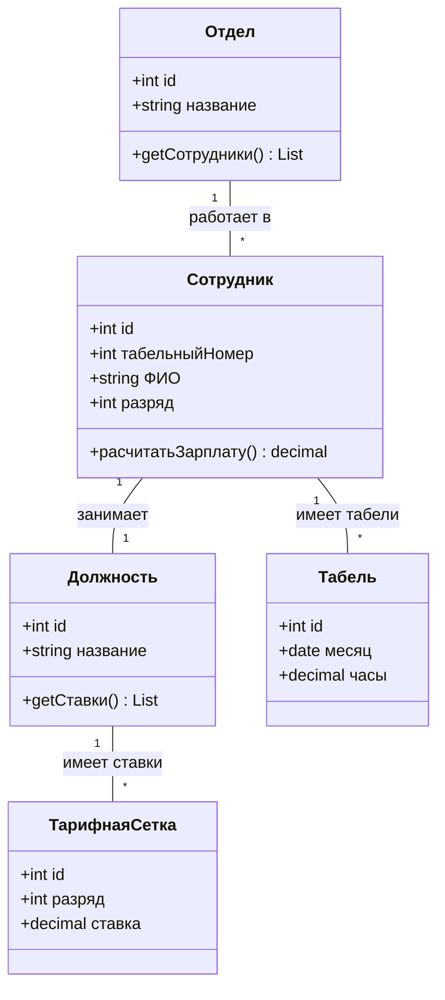
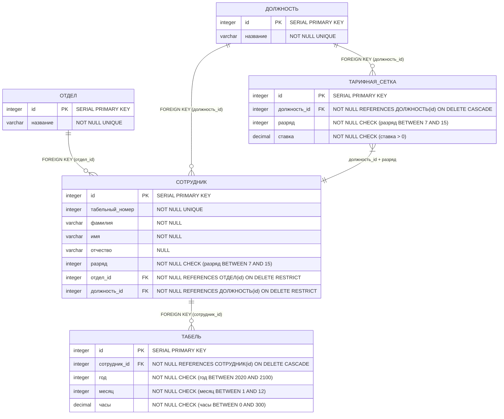

Лабораторные работы по Базам Данных  
Костюк Иван 02261-ДБ  
Вариант 20. Зарплата
Постановка задачи: Расчет заработной платы предприятия
1. Описание предметной области:
Система предназначена для автоматизации расчета ежемесячной заработной платы сотрудников предприятия, организованных в отделы. Расчет основывается на тарифной сетке (ставка за час) и данных об отработанном времени.

2. Перечень сущностей и их атрибутов (на основе ER-диаграммы):

ОТДЕЛЫ (departments)

id (PK) — Уникальный идентификатор отдела.

название (VARCHAR) — Наименование отдела.

СОТРУДНИКИ (employees)

id (PK) — Уникальный идентификатор сотрудника (внутренний).

табельный_номер (INT) — Уникальный табельный номер сотрудника.

фамилия (VARCHAR) — Фамилия сотрудника.

имя (VARCHAR) — Имя сотрудника.

отчество (VARCHAR) — Отчество сотрудника.

должность (VARCHAR) — Должность сотрудника (логически связана с ТАРИФНАЯ_СЕТКА.должность).

разряд (INT) — Разряд сотрудника (логически связан с ТАРИФНАЯ_СЕТКА.разряд).

id_отдела (FK -> ОТДЕЛЫ.id) — Идентификатор отдела, в котором работает сотрудник.

ТАРИФНАЯ_СЕТКА (pay_scales)

id (PK) — Уникальный идентификатор записи в тарифной сетке.

должность (VARCHAR) — Наименование должности.

разряд (INT) — Разряд (от 7 до 15).

ставка_руб_час (DECIMAL) — Часовая тарифная ставка для данной должности и разряда.

ТАБЕЛЬ (timesheets)

id (PK) — Уникальный идентификатор записи в табеле.

id_сотрудника (FK -> СОТРУДНИКИ.id) — Идентификатор сотрудника.

год (INT) — Год отчетного периода.

месяц (INT) — Месяц отчетного периода.

отработано_часов (DECIMAL) — Количество часов, отработанных сотрудником в указанном месяце.

3. Связи между сущностями (Relationships):

РАБОТАЕТ (рабочее место): Связь между СОТРУДНИКИ и ОТДЕЛЫ. Один сотрудник работает только в одном отделе (id_отдела). В одном отделе может работать много сотрудников. (1:N).

ИМЕЕТ_ТАРИФ: Связь между СОТРУДНИКИ и ТАРИФНАЯ_СЕТКА. Ставка сотрудника определяется парой атрибутов (должность, разряд), которые должны существовать в тарифной сетке. Это логическая связь по атрибутам.

ИМЕЕТ_ЗАПИСИ (табель учета): Связь между СОТРУДНИКИ и ТАБЕЛЬ. На одного сотрудника ежемесячно заводится одна запись в табеле (за конкретный год и месяц). Для одного сотрудника набирается много записей за разные периоды. (1:N).

4. Основные бизнес-процессы:

Управление справочниками: Ведение списка отделов и тарифной сетки.

Управление кадрами: Ведение списка сотрудников, их привязка к отделам и назначение должности/разряда.

Учет рабочего времени: Ежемесячное заполнение табеля учета рабочего времени для каждого сотрудника.

Расчет заработной платы: Автоматический расчет суммы к выплате для каждого сотрудника за период по формуле:
Зарплата = (Ставка_сотрудника) * (Отработано_часов)
где Ставка_сотрудника определяется поиском в ТАРИФНАЯ_СЕТКА по его должности и разряду.

5. Требуемые выходные документы (отчеты):

Расчетная ведомость за период: Список для выдачи зарплаты сотрудникам за указанный месяц и год. Должен содержать: отдел, табельный номер, ФИО, должность, разряд, часовую ставку, количество отработанных часов, сумму к выплате. Упорядочить по отделам, а внутри отдела — по ФИО сотрудника.

Сводка по квалификации отделов: Аналитический отчет, показывающий распределение сотрудников по разрядам в разрезе отделов. Должен содержать: название отдела, разряд, количество сотрудников данного разряда в отделе. Упорядочить по названию отдела.
## ER-диаграмма

## Логическая модель по диаграмме

##Физическая модель 

##2 Лабораторная
Создаем 5 таблиц

далее записываем данные и выводим их для проверки для всех 5 таблиц

здесь Выполнены SELECT-запросы c JOIN

##3 Лабораторная

создадим 2 представления 
расчетная ведомость

сводка по разрядам

процедура для подсчета зарплаты

процедура для добавления табеля
