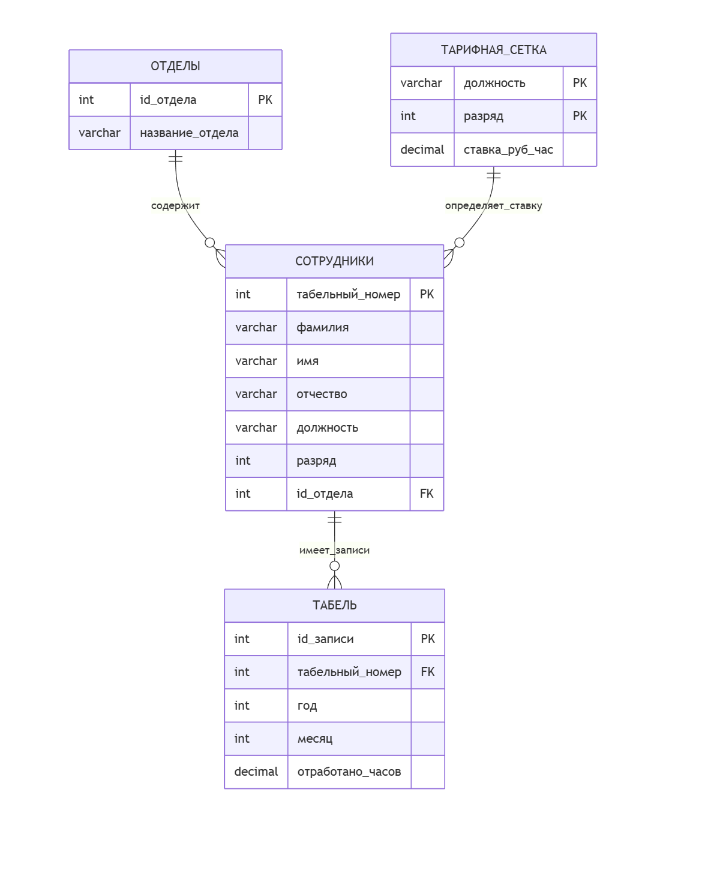

# labsforBASE
Лабораторные работы по Базам Данных  
Костюк Иван 02261-ДБ  
Вариант 20. Зарплата
## ER-диаграмма

## Логическая модель по диаграмме
**Сущность "Отделы"** 

Ключевой атрибут: id_отдела (уникальный идентификатор)

Описательные атрибуты: название_отдела (строка, обязательный)

**Сущность "Тарифная_сетка"** 

Ключевой атрибут: составной ключ (должность, разряд)

Описательные атрибуты:

должность (строка, обязательный)

разряд (целое число, обязательный, от 7 до 15)

ставка_руб_час (число, обязательный)

**Сущность "Сотрудники"**

Ключевой атрибут: табельный_номер (уникальный идентификатор)

Описательные атрибуты:

фамилия (строка, обязательный)

имя (строка, обязательный)

отчество (строка, обязательный)

должность (строка, обязательный)

разряд (целое число, обязательный, от 7 до 15)

Атрибуты-связи:

id_отдела (внешний ключ к сущности "Отделы", обязательный)

**Сущность "Табель"**

Ключевой атрибут: id_записи (уникальный идентификатор)

Описательные атрибуты:

год (целое число, обязательный)

месяц (целое число, обязательный, от 1 до 12)

отработано_часов (число, обязательный)

Атрибуты-связи:

табельный_номер (внешний ключ к сущности "Сотрудники", обязательный)
